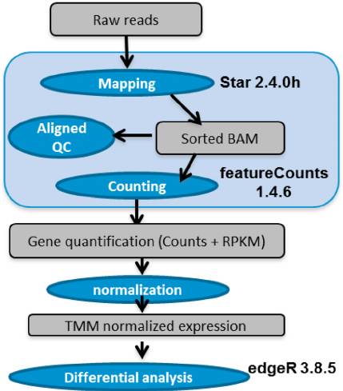

```{r setup, include=FALSE}
knitr::opts_chunk$set(echo = TRUE)
```

# I. Abstract.

In this microarray analysis, a study on the sensitivity of two human-cell types (HEK and B cells) has been chosen (GEO reference GSE11892). In the following, the experiment, data, and analysis workflow are described. An in-depth analysis of the microarray is carried out through Next-Generation Sequencing techniques to know whether the sensitivity of cells is different.

# II. Objetivos.

Queremos saber si existen diferencias en la expresión genética de dos tipos de células humanas: HEK y B.

# III. Materiales y métodos.

## III.1. Los datos.

Están disponibles a través del identificador GSE11892 en Gene Expression Omnibus (GEO). Se trata de un microarray (obtenido a través de _high throughput sequencing_) en el que se analizó la expresión de RNA de los grupos de células B y HEK humanas. Para evaluar si los valores son un indicador fiable sobre la actividad génica, se correlaron con ocupación de RNA polymerase II (PolIIa) hipofosforilado, utilizado como marcador del inicio de transcripción.

Más información disponible en: https://www.ncbi.nlm.nih.gov/geo/query/acc.cgi?acc=GSE11892


## III.2. Métodos.

Para analizar los datos del microarray hemos seguido un workflow que comienza por crear todas las carpetas necesarias en el fichero en que nos encontremos. A continuación, obtenemos los datos de GEO que se nos proporcionaron para realizar este análisis. Una vez importados a R, podemos explorar estos datos, realizar un control de calidad, normalizarlos y filtrarlos. Una vez hecho esto, podemos anotar los resultados, realizar comparaciones múltiples y un análisis de significación biológica.

El workflow sigue los pasos estándar para un análisis de RNAseq analysis, tal y como se describe en la siguiente figura, obtenida de DOI: [10.1186/s12864-015-1876-7](https://doi.org/10.1186/s12864-015-1876-7).

```{r RNAseqPipeline, echo=FALSE}

```

Cabe recordar que es común empezar el workflow desde la tabla de cuentas ( _counts table_ ) que resulta del paso de cuantificación de genes, como es nuestro caso.

## III.3. Librerías, directorios y funciones.

Comenzamos cargando todas las librerías que nos harán falta a lo largo del análisis.

```{r cho = T, results = 'hide'}
suppressMessages( library(Biobase) )
suppressMessages( library(GEOquery) )
suppressMessages( library(affy) )
suppressMessages( library(limma) )
suppressMessages( library(Glimma) )
suppressMessages( library(annotate) )
suppressMessages( library(annaffy) )
suppressMessages( library(gplots) )
suppressMessages( library(genefilter) )
suppressMessages( library(oligo) )
suppressMessages( library(arrayQualityMetrics) )
suppressMessages( library(ggplot2) )
suppressMessages( library(ggrepel) )
suppressMessages( library(gmodels) )
suppressMessages( library(affyQCReport) )
suppressMessages( library(edgeR) )
suppressMessages( library(RColorBrewer) )
suppressMessages( library(pasilla) )
suppressMessages( library(DESeq) )
suppressMessages( library(DESeq2) )
suppressMessages( library(AnnotationDbi) )
suppressMessages( library(org.Hs.eg.db) )
```

Para facilitar el estudio, trabajaremos en un directorio escogido por nosotros y cuya localización se asigna a la variable `workingDir`. Los datos se encuentran en un subdirectorio del anterior denominado `data`, que se almacenará en la variable `dataDir` y los resultados se almacenarán en un directorio `results`, cuyo nombre se almacenará en la variable `resultsDir`.

```{r}
workingDir <- getwd()
# Creamos los directorios de datos y resultados:
#system("mkdir results")

# Los asignamos a variables:
dataDir <-file.path(workingDir, "datasets")
resultsDir <- file.path(workingDir, "results")

# Seleccionamos el directorio de trabajo:
setwd(workingDir)
```

# IV. Resultados

## IV.1. Obtención y lectura de los datos.

Cargamos los datos del dataset 4, que hemos escogido para realizar este análisis, que consiste en una tabla de conteo o _count table_:

```{r}
# Creamos la tabla a partir del fichero:
count.table <- read.table(file.path(dataDir,"dataset4_count_table.txt"), header=TRUE, sep="\t", row.names=1, quote="", comment.char="")

# Estudiamos sus dimensiones:
dim(count.table)


# Nombre de columnas:
colnames(count.table)

# Y echamos un vistazo a los primeros registros:
head(count.table)
```

El objeto `count.table` contiene información sobre los genes (un gen por fila), cuyas  columnas contienen información sobre el número de lecturas que se alinean con el gen en cada muestra experimental.

Relación nombre de las columnas con las células analizadas (buscando en la información dada en GEO GSE11892):

- SRX008331: HEK293T cells rep_1
- SRX008332: HEK293T cells rep_2
- SRX008333: B cells rep_1
- SRX008334: B cells rep_2

Vamos a renombrar las columnas para saber a qué célula y repetición se refieren:

```{r}
# Cambiamos los nombres de las columnas de la tabla:
colnames(count.table) <- c("B1","B2","H1","H2")
# Vemos cómo han cambiado:
colnames(count.table)

```

Almacenamos la información del tipo de célula (B o H) en un vector `cond.type`:

```{r}
cond.type <- c("B","B","H","H")
```


## IV.2. Exploración, control de calidad y normalización.

**Filtrado**.

Los genes con recuentos muy bajos en todas las bibliotecas proporcionan poca evidencia en la expresión diferencial e interfieren con algunas de las aproximaciones estadísticas que se utilizan más adelante dentro del pipeleine del análisis.

Estos genes deben filtrarse antes de un análisis posterior.

```{r}
# Descartamos los genes que no se detectaron en la muestra:
count.table <- count.table[rowSums(count.table) > 0,]

# Ahora nuestra tabla contiene menos filas:
dim(count.table)
```

Hemos pasado de 52580 genes a 9010.


**Análisis descriptivo**:

Vamos a realizar un pequeño estudio descriptivo del dataset a analizar

```{r}
# Histograma (distribución) de count.table:
col <- c("green","green","orange","orange") ## Definimos los colores necesarios para los subsiguientes gráficos
hist(as.matrix(count.table))

# No es muy informativo debido a la presencia de unos pocos conteos muy elevados, 
# que resulta en una escala muy grande en el eje x. 

# Usaremos una transformación logarítmica para lograr una merjor legibilidad. 

# Distribución en escala logarítmica:
hist(as.matrix(log2(count.table + 1)),  breaks=100, col=col)

# Boxplot log:
boxplot(log2(count.table + 1), col=col)

# Scatter plots:
plotFun <- function(x,y){ dns <- densCols(x,y); points(x,y, col=dns, pch=".") }
pairs(log2(count.table + 1), panel=plotFun, lower.panel = NULL)
```

Los gráficos de dispersión para cada par de columnas del conjunto de datos muestran un “grado de reproducibilidad” alto entre muestras del mismo tipo celular: todos los puntos están alineados a lo largo de la diagonal, con una dispersión relativamente más ancha en la parte inferior, que corresponde a pequeñas fluctuaciones numéricas.

Por el contrario, en todas los gráficos que comparan células, podemos ver algunos puntos (genes) descartados de la diagonal, en el lado de la muestra con células HEK o B.

**DGEList**:

A continuación crearemos un objeto DGEList a partir de `count.table`. Este es un objeto utilizado por edgeR para almacenar datos de recuento.

```{r}
y <- DGEList(count.table)
# Echamos un vistazo:
y
# Mostramos los nombres almacenados:
names(y)
# La información sobre el tamaño de la librería se guarda en la variable samples:
y$samples
```


### IV.2.1. Control de calidad.

Ahora que hemos eliminado los genes de baja expresión y hemos almacenado nuestros conteos en un objeto DGEList, vamos a llevar a cabo algunos gráficos que nos permitan realizar un pequeño informe de los mismos.

**Tamaño de las librerías y gráficos de distribuciones**.

Verificamos cuántas lecturas tenemos para cada muestra en el objeto creado:

```{r}
y$samples$lib.size
```

Graficamos estos números en un diagrama de barras para ver si hay discrepancias importantes entre las muestras:

```{r}
barplot(y$samples$lib.size,names=colnames(y),las=2,col=col)
title("Barplot of library sizes")
```

Los “ounting data” (datos de recuento) no se distribuyen segun una Distribución Normal, por lo que si queremos examinar las distribuciones de los recuentos sin procesar, utilizaremos Boxplots para verificar la distribución de los recuentos de lectura en escala log2.

Podemos usar la función `cpm` para obtener recuentos de log2 por millón, corregidos por los library sizes (tamaños de biblioteca). La función cpm también incorpora una pequeña “modificación” para evitar el problema asociado al logaritmo de valores de cero.

```{r}
# Get log2 counts per million
logcounts <- cpm(y,log=TRUE)
# Check distributions of samples using boxplots
boxplot(logcounts, xlab="", ylab="Log2 counts per million",las=2, col=col)
# Let's add a blue horizontal line that corresponds to the median logCPM
abline(h=median(logcounts),col="blue")
title("Boxplots of logCPMs (unnormalised)")
```

De los boxplots, vemos que las distribuciones del counting no son muy diferentes.

**Multidimensional scaling (MDS) plot**.

Un MDSplot es un gráfico, que nos permite “visualizar” variabilidad en los datos. Si su experimento está bien “controlado”" y funcionó bien, lo que esperamos ver es que las principales fuentes de variación en los datos sean los grupos que nos interesan.

También nos puede ayudar en la visualización de valores atípicos. Podemos usar la función `plotMDS` para crear el diagrama de MDS.

```{r}
plotMDS(y,col=c("purple","purple", "orange", "orange"))
```

**Clustering jerárquico con heatmaps**.

La representación a través de un _heatmap_ nos permite obtener la representación del cluster jerárquico de las muestras.

```{r}
# We estimate the variance for each row in the logcounts matrix
var_genes <- apply(logcounts, 1, var)
head(var_genes)
# Get the gene names for the top 500 most variable genes
select_var <- names(sort(var_genes, decreasing=TRUE))[1:500]
head(select_var)
# Subset logcounts matrix
highly_variable_lcpm <- logcounts[select_var,]
dim(highly_variable_lcpm)
head(highly_variable_lcpm)

## Get some nicer colours
mypalette <- brewer.pal(11,"RdYlBu")
morecols <- colorRampPalette(mypalette)
# Set up colour vector for celltype variable
col.cell <- col

# Plot the heatmap
heatmap.2(highly_variable_lcpm,col=rev(morecols(50)),trace="none", main="Variability of genes across samples",ColSideColors=col.cell,scale="row")
```

```{r}
# Guardamos heatmap
png(file=file.path(resultsDir,"High_var_genes.heatmap.png"))
heatmap.2(highly_variable_lcpm,col=rev(morecols(50)),trace="none", main="Variability of genes across samples",ColSideColors=col.cell,scale="row")
dev.off()
```


### IV.2.2. Normalización.

El procesos de normalización denominado TMM se realiza para eliminar los sesgos de composición (bias compostion) entre las bibliotecas.

Este método genera un conjunto de factores de normalización, donde el producto de estos factores y los tamaños de la biblioteca definen el tamaño efectivo de la biblioteca.

La función `calcNormFactors` calcula los factores de normalización entre bibliotecas.

```{r}
# Aplicamos la normalización al objeto DGEList:
y <- calcNormFactors(y)
```

Factores de normalización para estas muestras:

```{r}
y$samples
```

Los gráficos de “diferencia de medias”" muestran la expresión promedio (media: eje x) contra los cambios log-fold (diferencia: eje y).

```{r}
par(mfrow=c(1,2))
plotMD(y,column = 1)
abline(h=0,col="grey")
plotMD(y,column = 3)
abline(h=0,col="grey")
```


## IV.3. Selección de genes diferencialmente expresados.

### IV.3.1. Análisis basado en modelos lineales.

**Matriz de diseño**.

```{r}
# Definimos la variable de grupo según el tipo de célula analizada: B o H
group <- cond.type
group
```
```{r}
# Especificamos la matriz de diseño:
design <- model.matrix(~ 0 + group)
colnames(design) <- c("B","H")
design
```

**Transformación voom de los datos**.

`voom` estima la tendencia de la varianza respecto a la media en el counting data, para luego asignar un peso a cada observación en función de la predicción de la varianza (segun el modelo que nos da la tendencia). Los pesos se usan luego en el proceso de modelado lineal para ajustar la heterocedasticidad.

Este diagrama es importante ya que nos “informa” de si hay algún gen con “alta variabilidad” en nuestros datos, y sobretodo porque nos indica si hemos filtrado los recuentos bajos adecuadamente.

```{r}
par(mfrow=c(1,1))
v <- voom(y,design,plot = TRUE)
```

Ahora podemos comparar los boxplot despues antes y despues de normalizar. Los valores de expresión en `v$E` ya son valores en escala logarítmica log2.

```{r}
par(mfrow=c(1,2))
boxplot(logcounts, xlab="", ylab="Log2 counts per million",las=2,main="Non normalised logCPM")
## Let's add a blue horizontal line that corresponds to the median logCPM
abline(h=median(logcounts),col="blue")
boxplot(v$E, xlab="", ylab="Log2 counts per million",las=2,main="Voom transformed logCPM")
## Let's add a blue horizontal line that corresponds to the median logCPM
abline(h=median(v$E),col="blue")
```

Vemos como en el caso de los datos transformados por `voom` la dispersión de los datos es menor.

**Matriz de contrastes**:

Queremos saber si existen diferencias entre el tipo de células:

```{r}
cont.matrix <- makeContrasts(Cell=B-H,levels=design)
cont.matrix
```

### IV.3.2. Comparaciones múltiples.

**Test de expresión diferencial**.

Ahora que tenemos los datos obtenidos a partir de la función `voom`, podemos usar `limma` para obtener la expresión diferencial. Primero ajustamos un modelo lineal para cada gen usando la función `lmFit` en `limma`. `lmFit` necesita el objeto `voom` y la matriz de diseño que ya hemos especificado, que se encuentra dentro del objeto generado por `voom`:

```{r}
# Fit del modelo lineal:
fit <- lmFit(v)
names(fit)
```

Lleva a cabo la comparación entre las células HEK y B.

El resultado del análisis es una tabla, que para cada gen y cada comparación contiene un 1 (si el gen esta sobreexpresado o up en esta condición), un 0 (si no hay cambio significativo) o un -1 (si está down regulado).

```{r}
fit.cont <- contrasts.fit(fit, cont.matrix)
fit.cont <- eBayes(fit.cont)

summa.fit <- decideTests(fit.cont)
summary(summa.fit)
```

### IV.3.3. Anotación de resultados.

Como podemos ver la lista de genes significativamente expresados diferencialmente, presenta como única anotación el ID de Entrez Gene, que no es muy informativa.

Por tanto deberemos añadir alguna información de anotación adicional.

Vamos a llevarlo a cabo utilizando `org.Hs.eg.db package`.

```{r}
# Genome-wide annotation for Human:
columns(org.Hs.eg.db)
```

```{r}
# Adaptamos los nombres de las filas para poder extraer información:
example <- as.character(as.numeric(substr(rownames(fit.cont),start=5,stop=15)))
# Seleccionamos los genes que aparecen en este experimento:
ann <- select(org.Hs.eg.db,keys=example,columns=c("ENTREZID","SYMBOL","GENENAME"))
# Primeros registros:
head(ann)
```


```{r}
fit.cont$genes <- ann
topTable(fit.cont,coef=1,sort.by="p")
```

Podemos guardar esta tabla en formato _.csv_:

```{r}
limma.res <- topTable(fit.cont,coef=1,sort.by="p",n=100)
write.csv(limma.res,file=file.path(resultsDir,"annotation_results.csv"),row.names=FALSE)
```

Es evidente que hay algún error al realizar la tabla de anotaciones, pues el algoritmo no reconoce ningún símbolo ni nombre de gen.

**Gráficos post-test DE (Volcano plot,MAplot)**:

```{r}
# Queremos destacar los genes significativos:
par(mfrow=c(1,2))
plotMD(fit.cont,coef=1,status=summa.fit[,1], values = c(-1, 1))

# Para el volcano plot tenemos que especificar cuántos genes 'top' queremos destacar.
volcanoplot(fit.cont,coef=1,highlight=100,names=fit.cont$genes$SYMBOL)
```

### IV.3.4. Análisis de significación biológica.

Análisis de ontología genética (GO) utilizando la función `goana` en `limma`.

```{r error=TRUE}
go <- goana(fit.cont, coef=1,species = "Hs")
topGO(go, n=10)
```

En este caso no se encuentran genes que coincidan con los hayados en nuestro análisis. Seguramente esto se trate de un error relacionado con el ya mencionado al realizar la tabla de anotaciones.


# V.Discusión.

En este análisis hemos visto que no existen diferencias significativas entre la expresión génica de las células humanas HEK y B. 

Una limitación importante de nuestro análisis es que en el análisis de significación biológica no hemos hallado ninguna entrada de Gene Ontology. Esto se debe seguramente a un error al realizar la tabla de anotaciones en el apartado IV.3.3.

